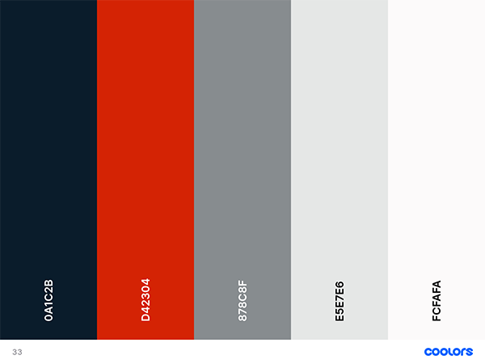
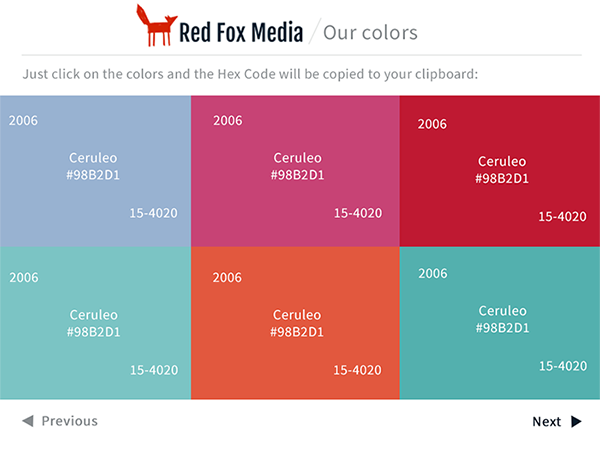
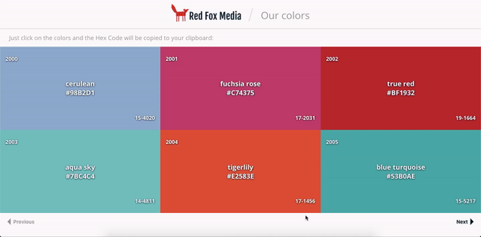

# 
# RED FOX MEDIA / Our Colors 

Esta es una aplicación sencilla para consultar y copiar de forma rápida los colores corportativos y oficiales de nuestra empresa.

Esta será de gran ayuda para estandarizar los trabajos y esfuerzos de nuestros creativos, diseñadores, desarrolladores y colaboradores de nuestra agencia digital.

## Prototipo

Primero se eligió una paleta de colores con qué trabajar para la app y se diseñó el logo de la empresa: 
- Paleta:

- Logo:

Luego se procedió a diseñar el prototipo en Photoshop: 

## Stack tecnológico
Para desarrollar la aplicación se utilizó: 
- React.js
- SASS
- Flexbox
- React Hooks
- react-copy-to-clipboard Library
- react-loader-spinner Library

## Resultado final

Aquí se puede observar el diseño final y la app en funcionamiento: 

## Cómo correr la aplicación
Para correr la app tienes que:
1. Descargar el zip.
2. Descomprimirlo.
3. Entrar en la cónsola y ubicarte en la carpeta del proyecto.
2. Correr `npm install .`
3. Correr `npm run start`

## Link de Deploy

También puedes entrar al deploy en el siguiente [link](https://red-fox-media-our-colors.netlify.app/)